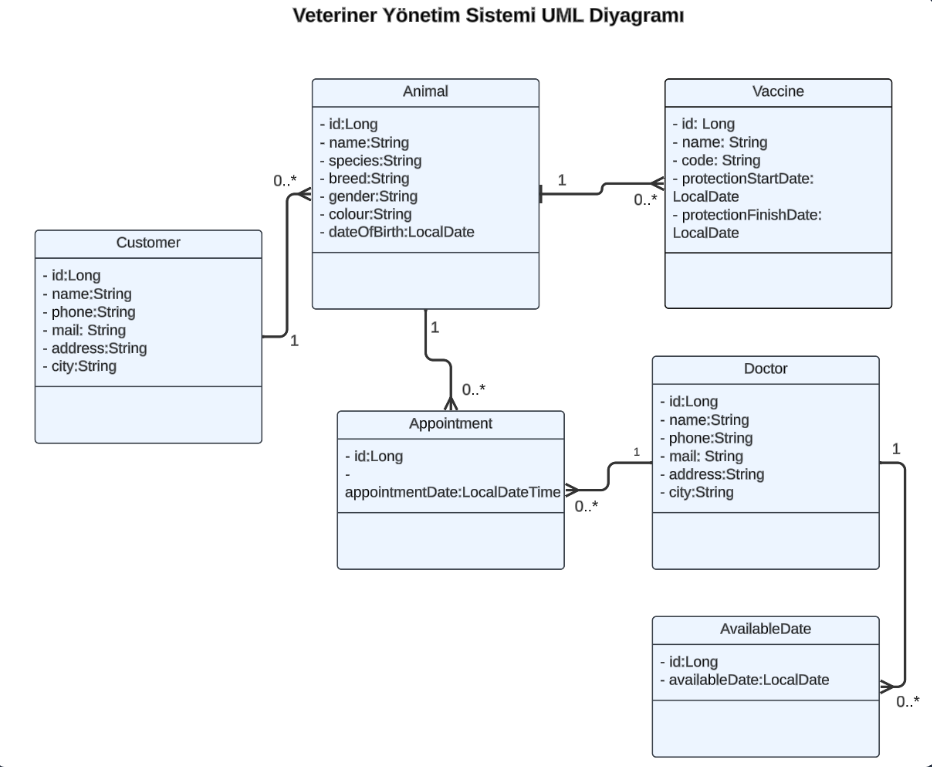

# Veterinary System Management Application

###
- In this project I made a veterinary application using java spring boot. I would like to briefly tell you about it

### VET APP CLASS DIAGRAM

## FEATURES

### Animal Properties
- Record, delete and update animals
- Search animals by name
- Filter animals by their owners and list them accordingly.

### Customer Properties
- Record, delete and update customers
- Filter customers according to their animals

### Doctor Properties 
- Record, delete and update doctors
- Identifying available days and taking these available days into account when creating appointments
- Filtering by doctor name

### Appointment Properties 
- When creating an appointment, first check the availability of the doctor on the day you want to create an appointment and then check if there is another appointment at that time
- When you list an appointment, you can see which animal, customer and doctor that appointment belongs to

### Vaccine Properties 
- Record, delete and update vaccinations.
- Before an animal is vaccinated, 2 things are checked:
1. Has the animal received the vaccine before?
2. If vaccinated, has the vaccine protection date expired?
   If the vaccine protection date has not expired, the vaccine is not administered to that animal
- According to the dates entered in the search section, you can view the animals whose vaccine protection date is close to expiration
- List vaccinations associated with specific animals.

### Database Structure 
- You can find more information about the database in the VetApp.sql file

### Endpoints
- From the endpoint.md file you can access the endpoints in the project and the experience of using them

